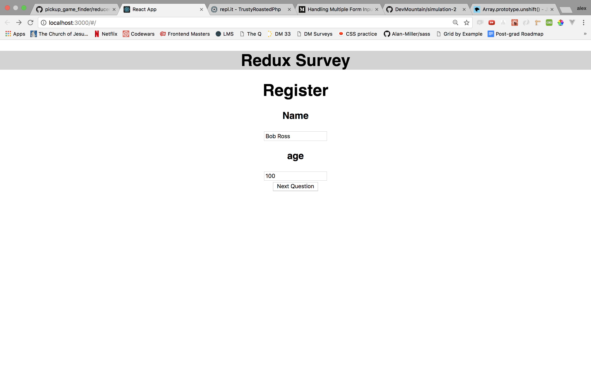
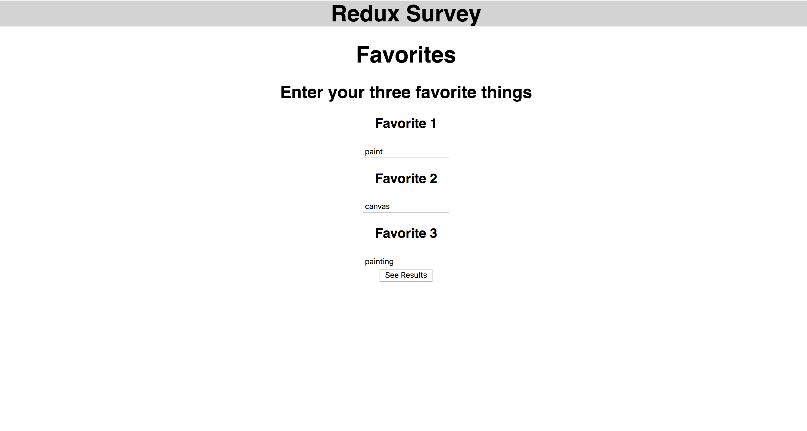
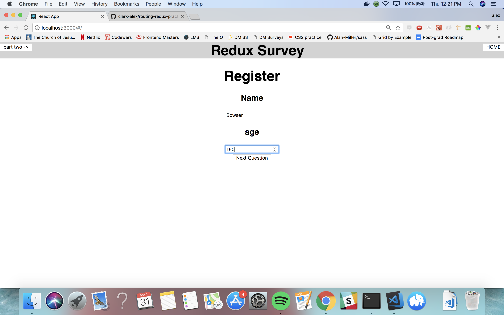
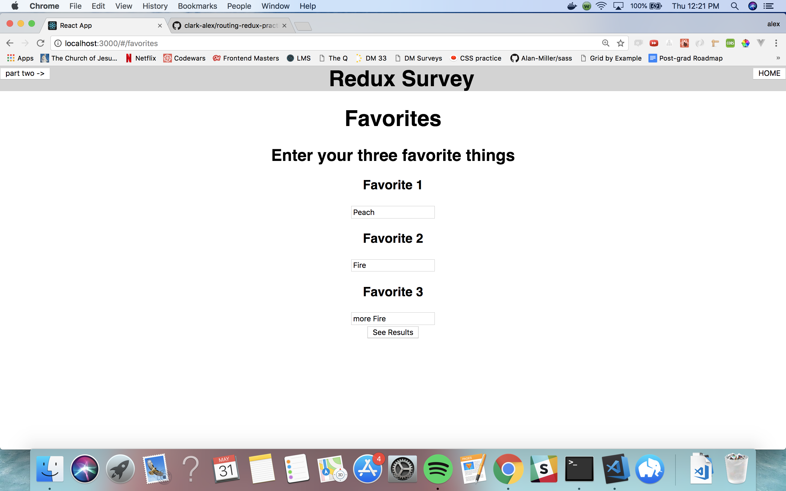
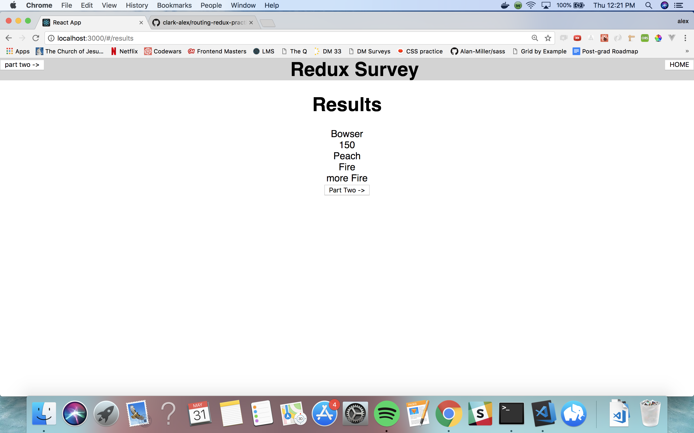
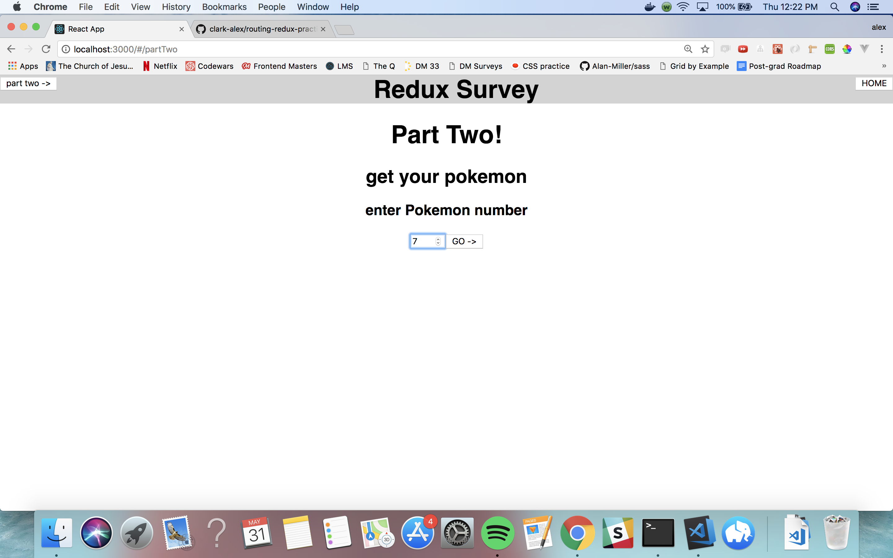

We are going to make a simple Survey App that Emphasizes Routing, and Redux

1)set up redux
npm i redux and react-redux
wrap your App with Provider in src/index.js
make a store file
make a ducks folder with a reducer in it.

2)set up routing
npm i react-router-dom
wrap your App and Provider with Hashrouter
make a router folder with a routes folder

the rest is up to you! # routing-redux-practice

Easy mode:

  
  
  

----------------
Hard mode:

  
  
  
  
  

